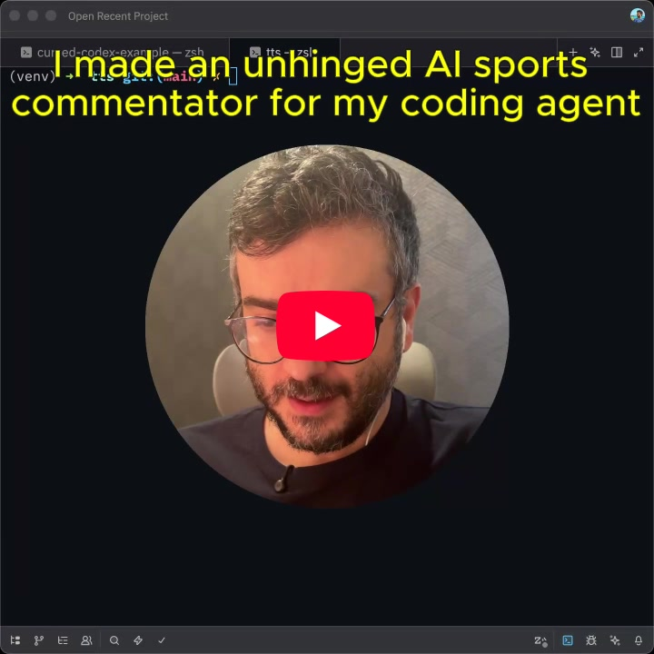

# Cursed Codex

An AI sports commentator that watches [OpenAI Codex](https://github.com/openai/codex) code in real-time and narrates every move like a Premier League match.

Errors are red cards. Passing tests are goals. The AI agent is "the lad."

[](https://www.youtube.com/watch?v=6WIBpcpSxww)

## How it works

```
Codex (TCP:4222) --> Python server (filter + LLM + TTS) --> Audio
```

1. A patched Codex CLI exposes a TCP event tap on port 4222
2. The Python TTS server connects, receives coding events (file edits, commands, patches, errors)
3. Events are filtered and fed to an LLM that generates commentary
4. Pocket TTS converts the commentary to speech using a locally cloned voice

## Setup

### 1. Build patched Codex

Requires Rust. The setup script clones Codex, checks out a pinned commit, applies the event-tap patch, and builds:

```bash
./setup.sh
```

The patched binary ends up at `vendor/codex/codex-rs/target/release/codex`.

### 2. Set up the TTS server

Requires Python 3.11+.

```bash
cd tts
python -m venv venv
source venv/bin/activate
pip install pocket-tts scipy openai python-dotenv requests
```

Create a `.env` file in `tts/` with your OpenRouter API key:

```
OPENROUTER_API_KEY=sk-or-v1-your-key-here
```

### 3. (Optional) Shell alias

Add to your `~/.zshrc` or `~/.bashrc` so you can run the patched Codex from anywhere:

```bash
function cursed-codex() {
  (/path/to/codex-commentator/vendor/codex/codex-rs/target/release/codex "$@")
}
```

## Running

Start the TTS server in one terminal:

```bash
cd tts
source venv/bin/activate
python server.py
```

Start the patched Codex in another terminal:

```bash
cursed-codex
```

The server auto-connects to Codex via TCP, filters events, generates commentary, and speaks it.

An HTTP endpoint is also available for manual testing:

```bash
curl -X POST http://localhost:8080 -d '{"text":"[task_started] Task started"}'
```

## LLM experiments

The `tts/` folder contains several LLM prompt experiments (`llm_01` through `llm_07`). The active one is configured in `tts/llm.py`. The default (`07_direct`) passes raw Codex events to the LLM and lets it commentate freely.
